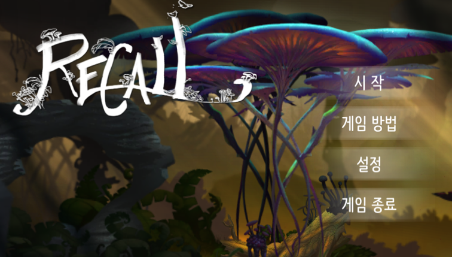
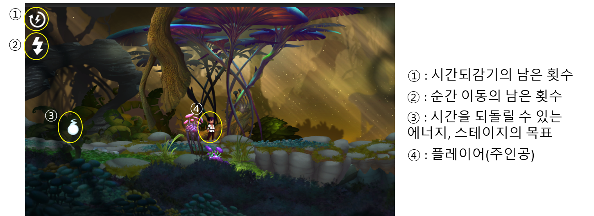

## Recall

- 개발 엔진 : Unity5.6.6
- 개발 언어 : C#
- 플랫폼 : Android

--- 

### **프로젝트 소개**

1. 일정 시간 전의 위치로 이동하는 **시간 되돌리기** 기술
2. 순간적으로 일정거리를 이동하는 **순간 이동** 기술

 - 두 가지 기술을 사용하여 장애물(버튼/문)을 통과하며 스테이지를 클리어하는 액션 퍼즐 게임입니다. 

